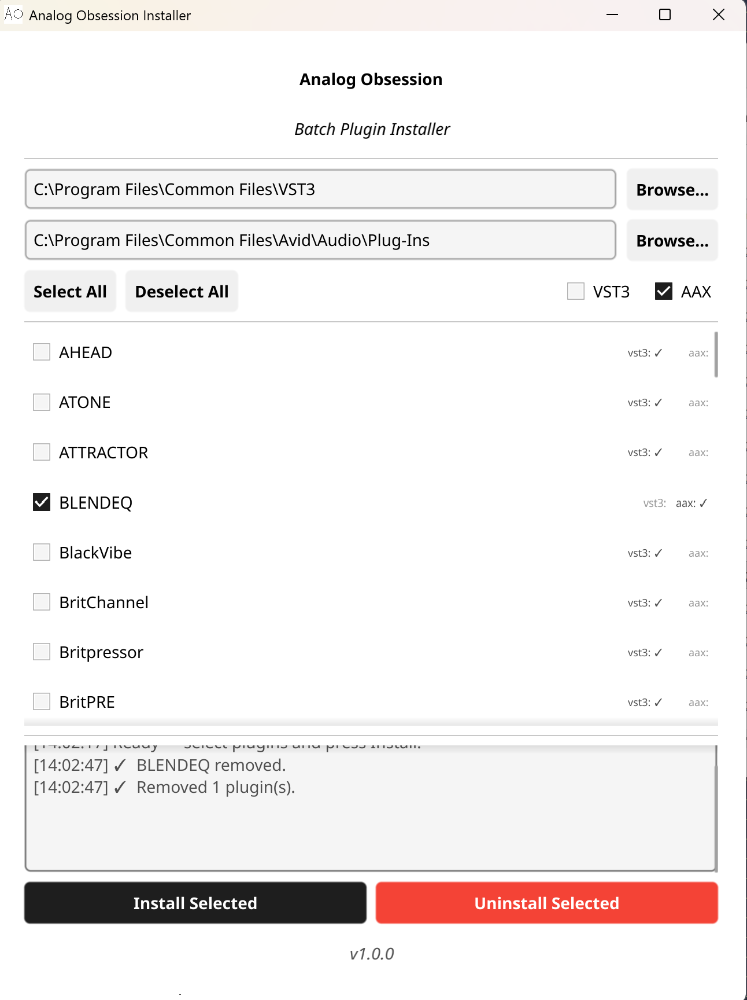

# Analog Obsession Installer

A fan-made batch installer for the free VST3/AAX plugins by **Analog Obsession**.

> **Disclaimer** — This is an independent fan project with no affiliation to, endorsement by, or relationship with Analog Obsession or its creator. All plugins are the intellectual property of their respective author. This tool simply automates downloading and placing the files you could install manually yourself.

---



## What it does

Lists all free Analog Obsession plugins in one window. Select the ones you want (VST3 and/or AAX) and click **Install Selected** — the installer handles the rest.

## Requirements

- Windows 10 or 11 (64-bit)
- Administrator privileges (the installer will prompt via UAC)
- Internet connection

## Usage

1. Download `AOInstaller.exe` from [Releases](../../releases)
2. Run it — UAC will ask for elevation
3. Select the plugins you want
4. Click **Install Selected**

The default install paths are `C:\Program Files\Common Files\VST3` and `C:\Program Files\Common Files\Avid\Audio\Plug-Ins` for AAX. Both can be changed via the Browse buttons.

Installed plugins can be removed individually with the **Uninstall** button next to each entry.

## Credits

All plugins are created by **Analog Obsession** and distributed free of charge.  
Please support the creator directly:

| | |
|---|---|
| **Website** | [analogobsession.com](https://analogobsession.com) |
| **Patreon** | [patreon.com/analogobsession](https://www.patreon.com/analogobsession) |

If you find these plugins useful, consider becoming a patron. The plugins are free — the creator relies on community support to keep making them.

## Building from source

Requires Go 1.23+ and a C compiler (e.g. [TDM-GCC](https://jmeubank.github.io/tdm-gcc/) or MSYS2 MinGW).

```bat
build.bat
```

If you change `app.rc`, `app.manifest`, or `logo.ico`, regenerate `rsrc_windows_amd64.syso` with [`rsrc`](https://github.com/akavel/rsrc).

## License

MIT — see [LICENSE](LICENSE)  
Plugin files remain the property of their respective author and are subject to their original license terms.
